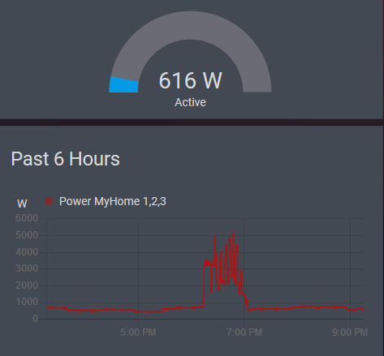
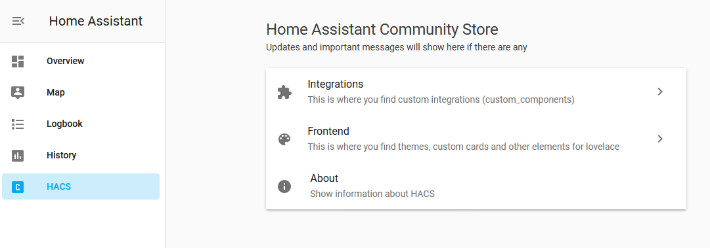
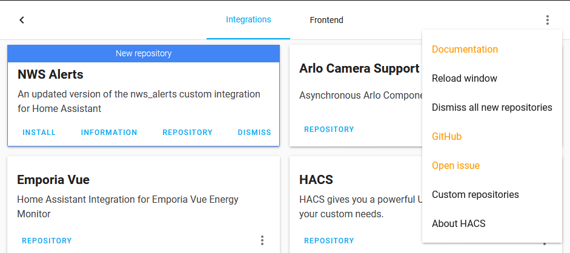
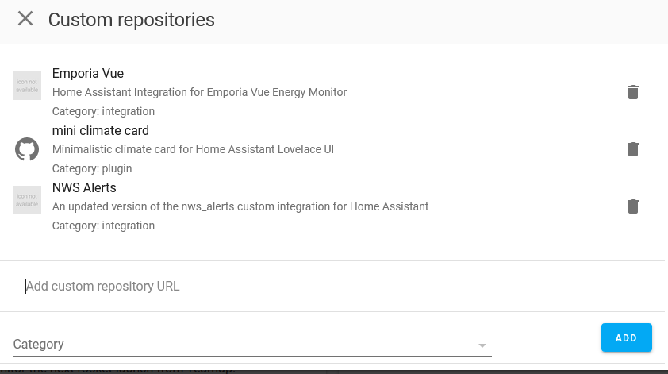
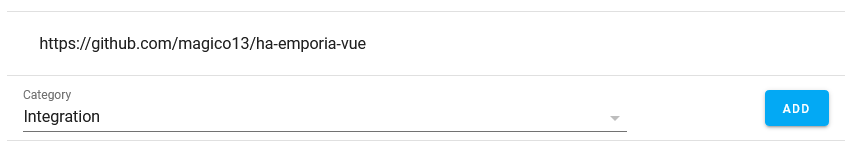

# emporia_vue Home Assistant Integration

Reads data from the Emporia Vue energy monitor. Creates a sensor for each device channel showing average usage over each minute.

Note: This project is not associated with or endorsed by Emporia Energy.

Data is pulled from the Emporia API using the [PyEmVue python module](https://github.com/magico13/PyEmVue), also written by me.

## Installation with HACS

The simplest way to install this integration is with the Home Assistant Community Store (HACS). This is not (yet) part of the default store and will need to be added as a custom repository.

Setting up a custom repository is done by:

1. Go into HACS from the side bar.
2. Click into Integrations.
3. Click the `+Explorer & Download Repositories`
4. In the UI that opens, enter `ha-emporia-vue` into the `Search for repository` field.
5. Pick `Emporia View` from the results.
6. Click the `Download` button.
7. The latest version is auto-selected.  Click the `Download` link.
8. Restart Home Assistant for the HACS integration to be applied.
9. Further configuration is done within the Integrations configuration in Home Assistant. You may need to restart home assistant and clear your browser cache before it appears, try ctrl+shift+r if you don't see it in the configuration list.

## Manual Installation

If you don't want to use HACS or just prefer manual installs, you can install this like any other custom component. Just merge the `custom_components` folder with the one in your Home Assistant config folder and you may need to manually install the PyEmVue library.

## Configuration

Configuration is done directly in the Home Assistant UI, no manual config file editing is required.

1. Go into the Home Assistant `Configuration`
2. Select `Integrations`
3. Click the `+` button at the bottom
4. Search for "Emporia Vue" and add it. If you do not see it in the list, ensure that you have installed the integration.
5. In the UI that opens, enter the email and password used for the Emporia App.
6. Done! You should now have a sensor for each "channel".

### Sensor Naming

Sensors are automatically named based on the information gotten from the Emporia API. They should be in the form `Power {Device_Name} {Channel_Id}` where the `Device_Name` is the name set in the Emporia app for the device and `Channel_Id` is the id of each sensor attached to the main Vue device. The Vue device itself has the channel id `1,2,3` indicating the three phase support built into the device. The sensor name can be changed in Home Assistant. Example: `Power Home 1,2,3`

The Entity ID for each sensor is similar to the name but cannot be changed. The Entity ID uses the internal id of the device rather than the name since the id cannot change but the name can, ie `sensor.power_{Device_Id}_{Channel_Id}`. Example: `sensor.power_7576_123`
